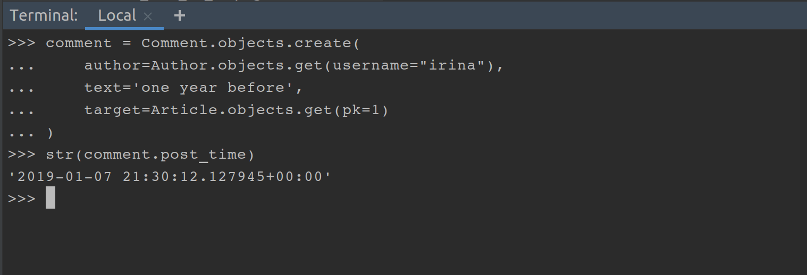
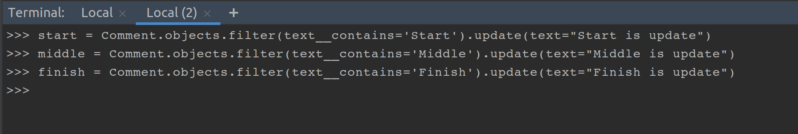

## ДЗ на урок 33

### Прочитать все ссылки из лекции!!! Буду спрашивать.

### Выполнить всё через шел и залить на гит скрины в отдельной папке (Ну или в личку в телеграм):

### Всё выполнять со своими моделями.

#### 1. Придумать 10 разных фильтров или эксклюдов, с разными лукапами и заходом в связанные модели.

##### стартовые комменты


##### 1.01 


##### 1.02


##### 1.03


##### 1.04


##### 1.05 


##### 1.06 


##### 1.07 


##### 1.08 


##### 1.09 


##### 1.10


#### 2. Получить 5 последних написанных коментариев (именно текст).


#### 3. Создать 5 коментариев с разным текстом, Хотя бы один должен начинаться со слова "Start", хоть один в середине должен иметь слово "Middle", хоть один должен заканчиваться словом "Finish".


#### 4. Переписать сейв коментария так, что бы при создании дата менялась бы на год назад (если сегодня 20 декабря 2019, должна выставляться 20 декабря 2018), изменение коментариев не затрагивать.

```python

    def save(self, **kwargs):
        if not self.pk:
            self.post_time = timezone.now() - timedelta(days=365)
        super().save(**kwargs)

```



#### 5. Изменить коментарии со спец словами "Start", "Middle", "Finish".



#### 6. Удалить все коментарии у которых в тексте есть буква "k", но не удалять если есть буква "с".

#### 7. Получить первые 2 коментария по дате создания к статье у которой имя автора последнее по алфавиту.